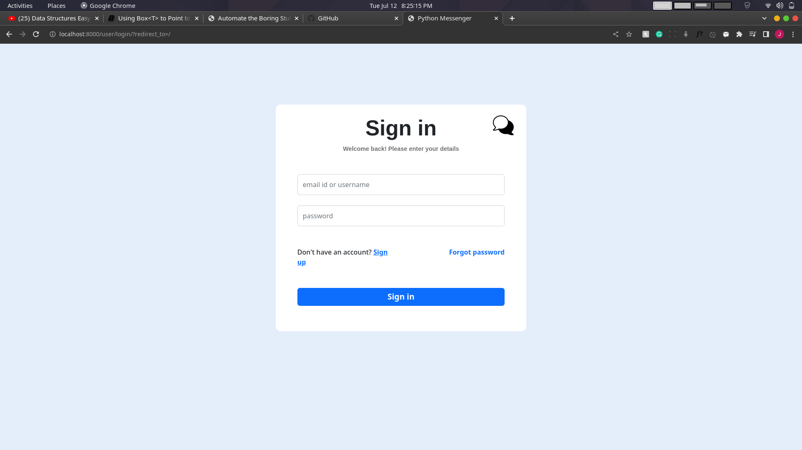
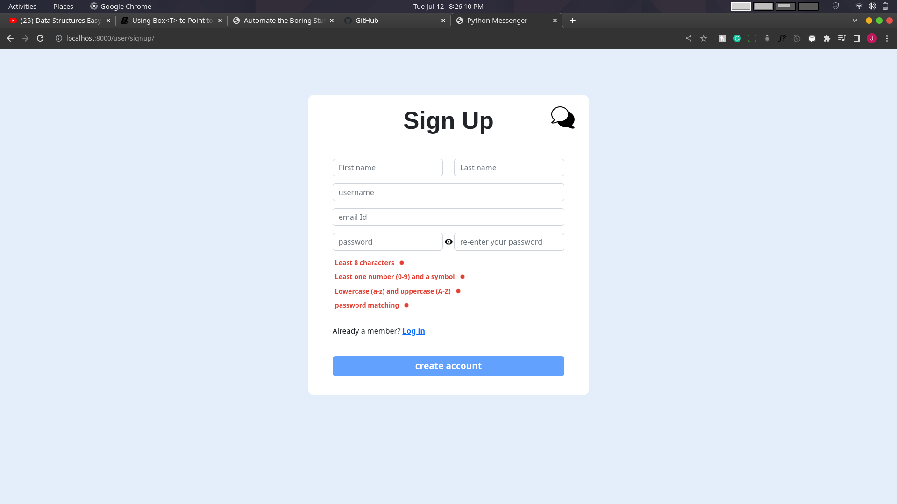
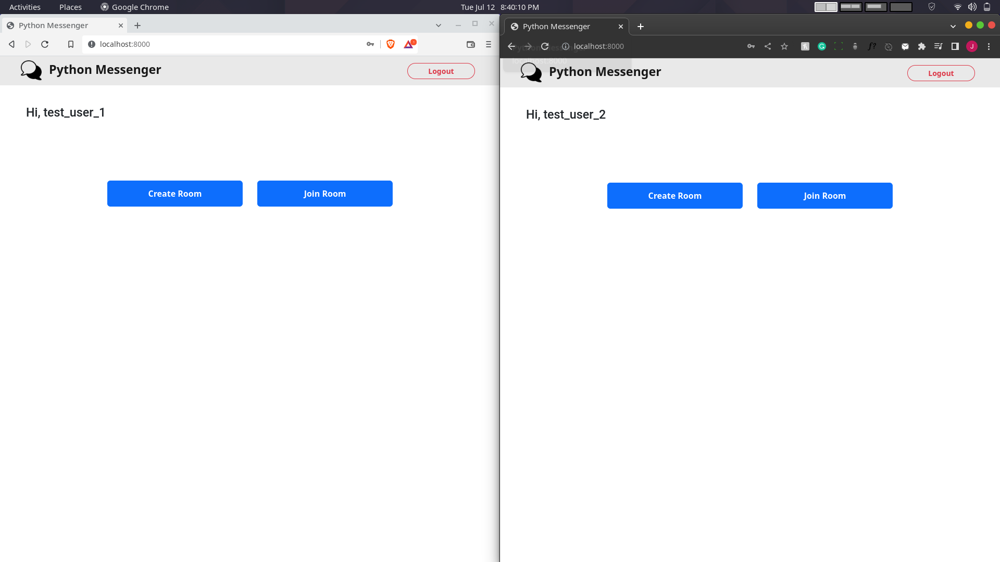
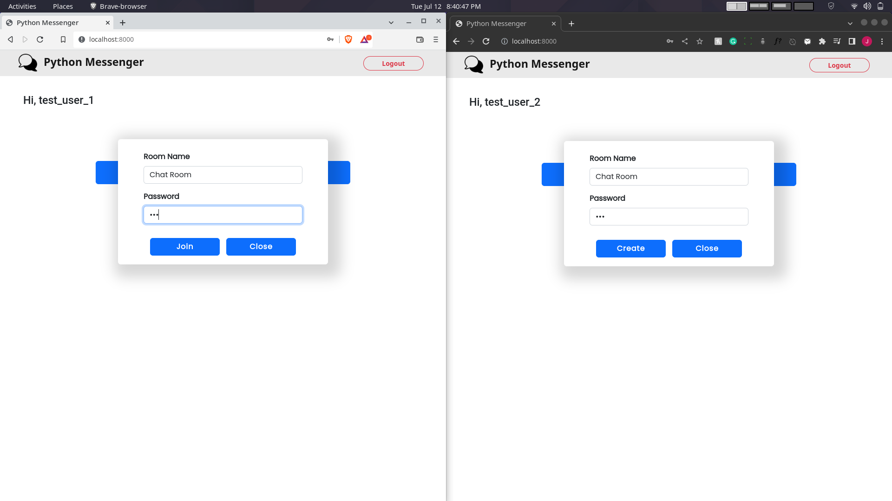
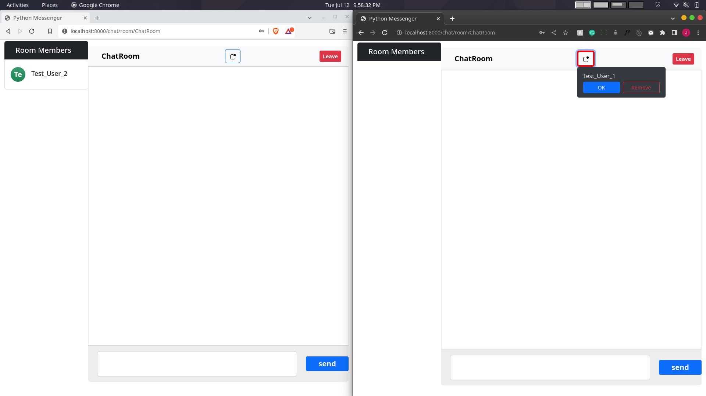
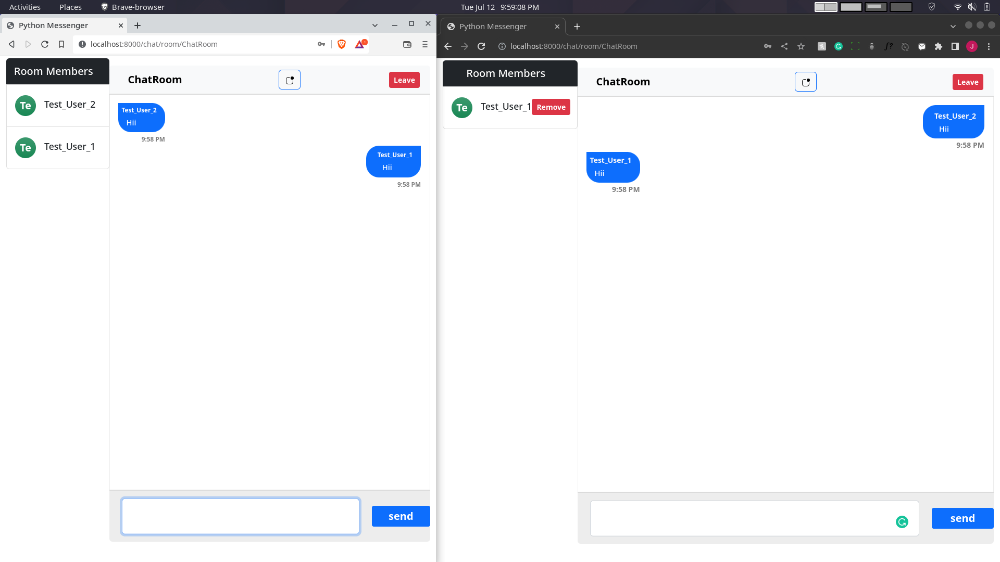

# Python Messenger
A real time messaging app, which uses sockets connection both in client and server side.

It was created using the Django framework which has the in-built sockets' library called `Django-Channels`, 
that gives us the ability to connect with the client-side application in real time.

In the client side of the application, I used the `Websockets API` with Javascript to establish a
connection with the server.

## To run the app

### To run the app:

Make sure you have installed <a href="https://www.djangoproject.com/download/">Django</a> & <a href="https://redis.io/download/">Redis</a> on your system. 
Run the `manage.py` file from the root folder.

- **On Windows:**
- `py manage.py runserver`

- **On Unix / Linux:**
- `python3 manage.py runserver`

Note: Before running the `manage.py` command, run the following commands

- `python manage.py makemigrations` and then `python manage.py migrate`
####
and then start the redis server.
- `redis-server`

## Dependencies

If running from source then dependencies can be installed from the `requirements.txt` file.

## Screenshots

## Credits
Icons: https://icons8.com/ 
